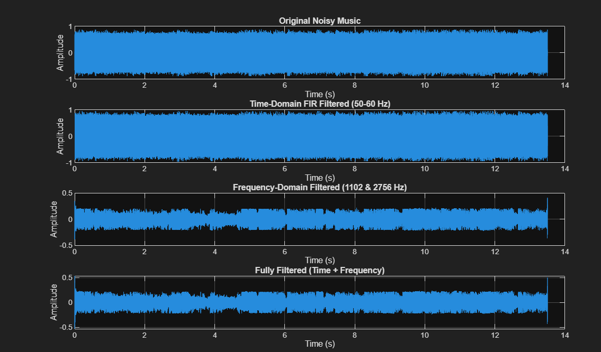
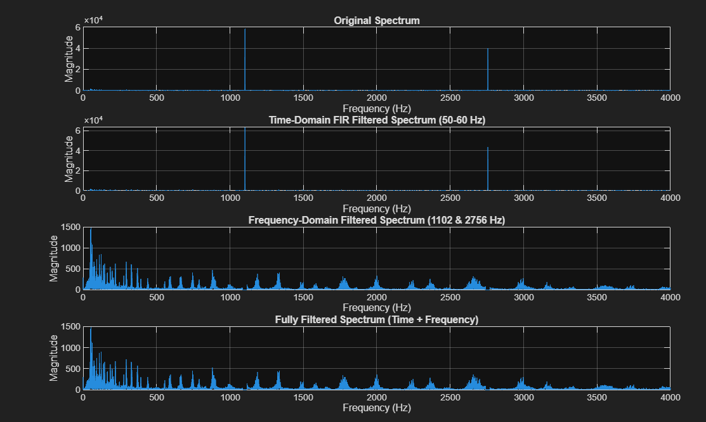

# Audio Signal Noise Reduction in MATLAB (Hybrid Time & Frequency Domain)


A digital signal processing (DSP) pipeline implemented in MATLAB to eliminate low-frequency hum and narrow high-frequency spectral spikes from a noisy audio recording (`music_noisy.wav`).

---

## 📌 Technical Summary

Spectral analysis (FFT) of the noisy audio signal revealed two distinct types of interference:
1. **Low-Frequency Hum (50–60 Hz):** Removed using a time-domain **FIR bandstop (notch) filter** (`fir1`), preserving linear phase response to prevent signal distortion.
2. **High-Frequency Spikes (1102 Hz & 2756 Hz):** Eliminated in the frequency domain by **zeroing out specific FFT bins**, followed by Inverse FFT (`ifft`) reconstruction.

By combining time-domain FIR filtering with frequency-domain notch zeroing, the pipeline successfully strips out electrical hum and narrow tones without degrading the original musical content.

---

## 📊 Visualizations & Results

| Time-Domain Waveforms | Frequency Spectra (FFT) |
| :---: | :---: |
|  |  |

---

## 📂 Repository Structure

```text
matlab-audio-filter/
├── README.md                  <-- Project description & results
├── docs/                      
│   ├── time-domain-graphic.png        <-- Waveform plots (Original vs Filtered)
│   └── frequency-domain-graphic.png   <-- FFT magnitude spectrum plots
└── src/                      
    └── audio-filter.m <-- Final working MATLAB script
