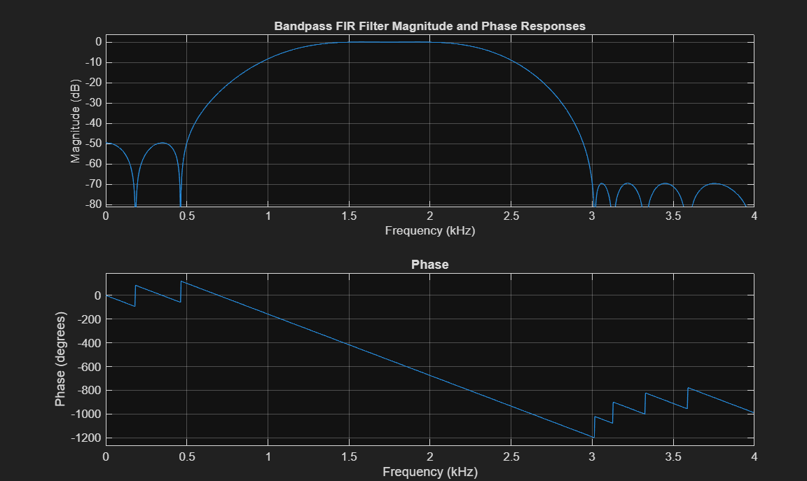
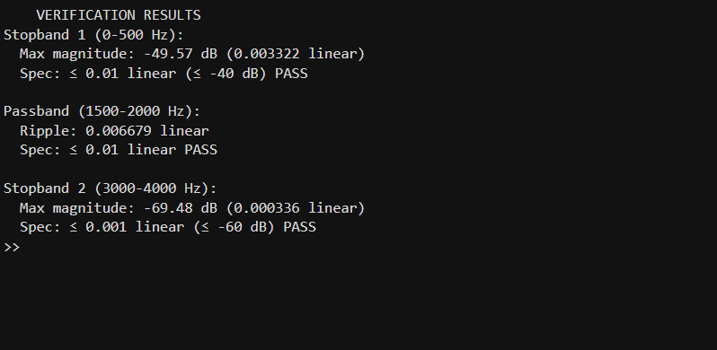
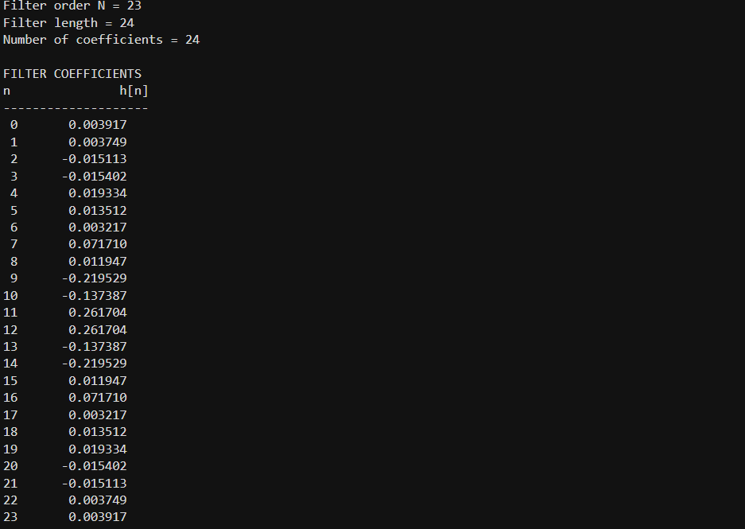

# Digital Filter Design & Audio Signal Processing (MATLAB)


A digital signal processing (DSP) project featuring custom FIR filter synthesis using the Parks-McClellan algorithm and a hybrid time-frequency domain pipeline for audio noise reduction.

---

## 📌 Project Overview

This repository is divided into two core signal processing applications:
1. **Equiripple FIR Bandpass Filter Synthesis & Verification:** Designing an optimal bandpass FIR filter to meet strict passband and stopband ripple constraints, using automated validation in MATLAB.
2. **Hybrid Audio De-Noising Pipeline:** Identifying low-frequency hum and high-frequency spectral spikes in a noisy recording (`music_noisy.wav`) and removing them using a combined time-domain FIR notch filter and frequency-domain FFT zeroing.

---

## 🔬 Technical Breakdown

### Part 1: Bandpass FIR Filter Design & Verification
Designed using the Parks-McClellan optimal equiripple algorithm (`firpm` / `firpmord`) with a sampling frequency $F_s = 8000\text{ Hz}$:
* **Stopband 1:** $0 - 500\text{ Hz}$ ($\text{Ripple} \le 0.01$ / $-40\text{ dB}$)
* **Passband:** $1500 - 2000\text{ Hz}$ ($\text{Ripple} \le 0.01$)
* **Stopband 2:** $3000 - 4000\text{ Hz}$ ($\text{Ripple} \le 0.001$ / $-60\text{ dB}$)
* **Order Optimization:** `firpmord` initially estimated an order of $N=19$, but verification revealed a passband ripple exceedance ($0.0198$). Manually increasing the filter order to **$N=23$** successfully satisfied all design specifications.

### Part 2: Dual-Stage Audio Noise Reduction
Spectral analysis (FFT) of the noisy music signal identified two distinct noise artifacts:
1. **50–60 Hz Low-Frequency Hum:** Attenuated using a time-domain FIR bandstop filter (`fir1`, order $N=200$) to maintain linear phase.
2. **1102 Hz & 2756 Hz High-Frequency Spikes:** Eliminated by zeroing out specific frequency bins in the FFT spectrum, followed by Inverse FFT (`ifft`) reconstruction.
3. **Combined Pipeline:** Sequentially applied time-domain FIR filtering and frequency-domain zeroing to strip electrical hum and narrow tones while maintaining audio signal integrity.

---

## 📊 Visualizations & Results

### Part 1: FIR Filter Synthesis & Verification
| Magnitude & Phase Response | Specification Verification | Frequency Response |
| :---: | :---: | :---: |
|  |  |  |

### Part 2: Audio De-Noising Output
| Time-Domain Waveforms | Frequency Spectra (FFT) |
| :---: | :---: |
|  |  |

---

## 📂 Repository Structure

```text
matlab-audio-filter/
├── README.md                     <-- Project documentation
├── docs/                         <-- Plot screenshots & terminal outputs
│   ├── bandpass-filter.png
│   ├── filter-design.png
│   ├── filter-verification.png
│   ├── frequency-domain-graphic.png
│   └── time-domain-graphic.png
└── src/                         <-- MATLAB source code
    ├── audio-filter.m            <-- Part 2: Audio de-noising script
    └── design-verification.m     <-- Part 1: FIR design & automated specs verification
